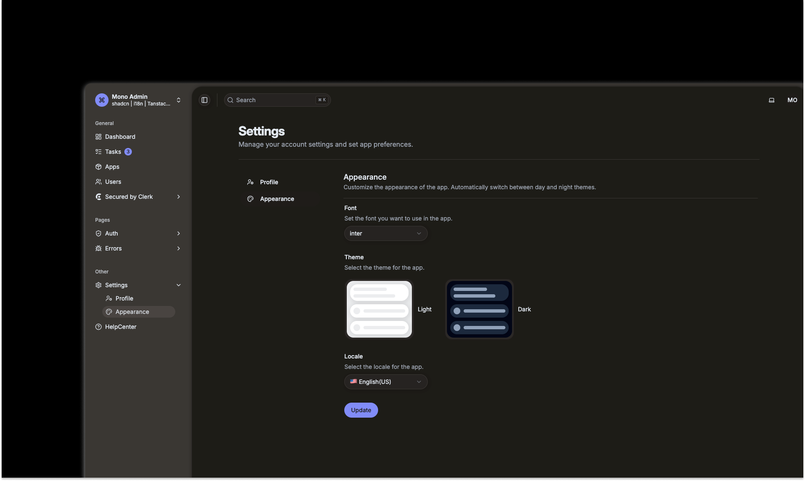

# Shadcn Admin Dashboard Monorepo

A modern admin dashboard monorepo built with shadcn/ui, TanStack Router, and i18n support. Designed to provide a scalable, modular, and multilingual admin interface for React projects.



## ⚠️ Important Notes

The project is actively evolving, but it is already production-ready and can be safely used in real applications.

## Features

- [x] Monorepo structure with multiple apps and shared packages

- [x] Shadcn UI for modern, accessible component library

- [x] TanStack Router for flexible and type-safe routing

- [x] i18n integration for multilingual support

- [x] Highly modular and extensible architecture

- [ ] More dashboard example pages

- [ ] Full Translations

## Local Development

```sh
# Install dependencies
pnpm install

# Start the dashboard app in development mode
pnpm --filter apps/dashboard dev

# Build the app
pnpm --filter apps/dashboard build

# Preview the production build
pnpm --filter apps/dashboard preview
```
